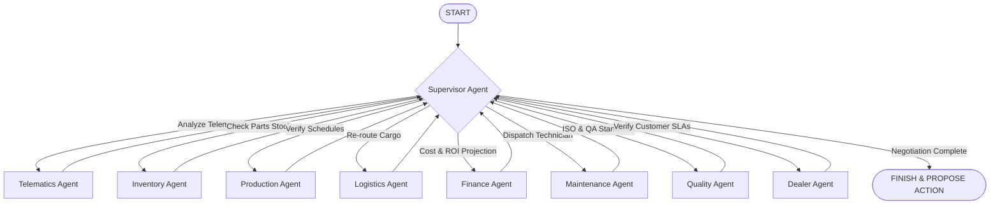

# AIRA — Autonomous Manufacturing Decision Platform

[](https://www.hackerearth.com/challenges/competitive/amd-ai-challenge/)
[](https://opensource.org/licenses/MIT)
[](https://fastapi.tiangolo.com)
[](https://nextjs.org)
[](https://github.com/langchain-ai/langgraph)
[](https://fireworks.ai)

AIRA (Autonomous Manufacturing Decision Platform) is a real-time operations control prototype designed for smart manufacturing plants and logistics fleets. AIRA integrates simulated IoT telematics, production scheduling, warehouse databases, and dealer SLAs into a unified multi-agent graph system. When an anomaly occurs, specialized agents negotiate a resolution, run simulations using a prototype digital twin model, and queue actions via the Model Context Protocol (MCP) for human approval.

---

## 📖 Table of Contents
1. [Overview](#-overview)
2. [Problem Statement](#-problem-statement)
3. [Key Features](#-key-features)
4. [Architecture Overview](#-architecture-overview)
5. [AI Workflow (LangGraph Multi-Agent System)](#-ai-workflow-langgraph-multi-agent-system)
6. [Kaggle Dataset Integration](#-kaggle-dataset-integration)
7. [Digital Twin Simulation](#-digital-twin-simulation)
8. [MCP Integration](#-mcp-integration)
9. [FastAPI Backend](#-fastapi-backend)
10. [Next.js Frontend](#-nextjs-frontend)
11. [Fireworks AI & AMD AI Challenge Context](#-fireworks-ai--amd-ai-challenge-context)
12. [Technology Stack](#-technology-stack)
13. [Folder Structure](#-folder-structure)
14. [Installation Guide](#-installation-guide)
15. [Environment Variables](#-environment-variables)
16. [Running the Application](#-running-the-application)
17. [API Endpoints](#-api-endpoints)
18. [Screenshots & Demo](#-screenshots--demo)
19. [Future Improvements](#-future-improvements)
20. [License & Contributors](#-license--contributors)

---

## 🔍 Overview

Operational disruptions in manufacturing—such as raw material transit delays or equipment overheating—frequently trigger chain-reaction delays across assembly lines. Resolving these issues involves complex trade-offs between logistics rerouting, maintenance dispatch costs, factory downtime, inventory availability, and customer SLA commitments.

AIRA addresses this challenge by deploying a **LangGraph-driven Multi-Agent System** that acts as an operations council. Specialist AI agents representing different business domains (Finance, Logistics, Inventory, Production, Maintenance, etc.) negotiate and align on resolutions. AIRA models each resolution using a **Digital Twin Simulator** to project the operational impact (e.g., cost savings, downtime hours) before executing actions. These actions are queued and executed through the **Model Context Protocol (MCP)**, ensuring a robust Human-in-the-Loop check.

---
## Screenshots

### Dashboard


### Dashboard View 2


### AI Copilot


### MCP Terminal & Digital Twin


---
## Demo Video

Click here to watch the demo: [Demo Video](https://github.com/user-attachments/assets/e48b7f8c-16b5-45f9-8414-d63e6367f3b8)
---

## ⚠️ Problem Statement

Modern industrial operations suffer from siloed data and delayed decision-making:
* **Siloed Systems**: ERP (Enterprise Resource Planning), MES (Manufacturing Execution Systems), and WMS (Warehouse Management Systems) rarely talk to each other in real-time.
* **Complex Trade-offs**: When a truck carrying critical parts experiences an anomaly, operators cannot easily calculate whether it is cheaper to halt the line, dispatch emergency mobile maintenance, reroute the truck, or source parts from an alternative warehouse.
* **Manual Approvals**: Standard IT structures lack secure, structured, and auditable pipelines to let AI tools inspect inventories and write schedules back to legacy systems.

---

## ✨ Key Features

* **Multi-Agent Negotiation Canvas**: A live visual dashboard illustrating how specialized agents communicate, negotiate, and converge on an operational decision.
* **Real-time Telemetry Processing**: Real-time telemetry calculations that stream anomalies (e.g., battery temperature spikes on critical transport trucks).
* **High-Fidelity Digital Twin Panel**: Side-by-side scenario comparisons (e.g., "Scenario A: Immediate Maintenance" vs. "Scenario B: Delay 6 Hours"), displaying metrics like OEE loss %, financial cost, and SLA delays.
* **Model Context Protocol (MCP) Terminal**: A real-time audit log showcasing ERP, MES, and WMS actions with secure human-in-the-loop approvals.
* **AI Operations Copilot**: A chat window powered by Fireworks AI that queries telemetry, logs, and sales data to render interactive Recharts visualizations.

---

## 🏗️ Architecture Overview

The platform uses a split-tier architecture linking the frontend visual canvas, the FastAPI backend agent processor, and external LLM services.

```
       +---------------------------------------------+
       |             Next.js Frontend (UI)           |
       |  - React 19 + Framer Motion (Animations)   |
       |  - Live WebSockets for Agent Negotiation    |
       |  - Interactive Recharts & Digital Twin panel|
       +---------------------------------------------+
                              |
                     REST APIs & WebSockets
                              v
       +---------------------------------------------+
       |            FastAPI Python Backend           |
       |  - LangGraph Orchestration State Machine     |
       |  - Agent Node Workflows (Specialists)       |
       |  - Digital Twin Impact Simulator            |
       |  - MCP Client Manager                       |
       +---------------------------------------------+
            |                                 |
     Inference API                     MCP / SSE Port
            v                                 v
+-----------------------+         +-----------------------+
|  Fireworks AI LLMs    |         |   FastMCP Server      |
|  - Llama 3.3 70B      |         |  - ERP/WMS Read/Write |
|  - Reasoning & Chat   |         |  - Work Order Dispatch|
|                       |         |  - Cryptographic logs |
+-----------------------+         +-----------------------+
```

---

## 🤖 AI Workflow (LangGraph Multi-Agent System)

AIRA models plant operations as a state-based multi-agent graph using **LangGraph**. The system leverages a hierarchical supervisor pattern to route problems to specialized specialists, gather consensus, and resolve conflicts.



### Specialist Agent Profiles:
1. **Supervisor Agent**: The orchestrator. Coordinates specialists, evaluates results, and produces the final unified recommendation.
2. **Telematics Agent**: Monitors vehicle GPS, engine temperature, vibration, and thermal telemetry.
3. **Inventory Agent**: Tracks warehouse stocks (WMS) to verify spare part availability.
4. **Production Agent**: Evaluates line schedules (MES), capacity utilization (OEE), and schedules breaks.
5. **Logistics Agent**: Calculates alternative routes, traffic delay offsets, and ETA changes.
6. **Finance Agent**: Quantifies operations, projecting downtime costs and ROI on emergency repairs.
7. **Maintenance Agent**: Allocates technicians, coordinates parts, and dispatches work orders.
8. **Quality Agent**: Inspects ISO standard compliance and product defect limits.
9. **Dealer Agent**: Protects customer SLAs and manages shipment delays.

### Agent Workflow Execution Detail:
* Each specialist agent node executes a prompt query via the LLM to generate structured text analysis, or falls back to pre-configured domain analysis if the LLM client is offline or encounters an error.
* The supervisor node determines the next routing edge dynamically via the LLM (using structured Pydantic schemas) or falls back to a deterministic sequence when offline.

---

## 📊 Kaggle Dataset Integration

AIRA integrates actual manufacturing and telematics datasets downloaded dynamically using the `kagglehub` library. The system loads:
1. **`programmer3/real-time-iot-driven-production-system-dataset`**: Used to generate vehicle time-series streams (including battery temperature, engine RPM, fuel level, and vibration readings).
2. **`programmer3/smart-manufacturing-process-data`**: Processed via `pandas` to calculate live factory KPIs such as Overall Equipment Effectiveness (OEE), production rate, defect rates, and unit energy consumption.

If the datasets fail to download or load, the system falls back to structured telemetry templates.

---

## 🌐 Digital Twin Simulation

The Digital Twin simulator functions as a prototype impact projector:
* **Scenario A (Immediate Maintenance)**: The simulator details the scheduled break extension, technician travel times, repair costs, and verifies that SLA buffers are maintained.
* **Scenario B (Run-to-Failure)**: The simulator projects unplanned downtime, production drop percentage, contract penalties, and financial losses if maintenance is deferred.

The simulator outputs pre-defined comparison scenarios comparing Scenario A and Scenario B.

---

## 🔌 MCP Integration

AIRA implements the **Model Context Protocol (MCP)** via a client-server structure:
1. **Tool Discovery**: Exposes read/write tools for ERP, WMS, and MES systems using `FastMCP` (with mock databases representing the enterprise software stack).
2. **Staged Approvals**: The approval queue simulates manual staging of write operations (e.g., updating purchase order priority, locking inventory slots, extending line breaks).
3. **Execution Log**: Once approved, the MCP client executes the tools locally against mock databases and returns the execution logs.

---

## ⚡ Fireworks AI & AMD AI Challenge Context

This project is built as a submission for **Track 3 (Unicorn/Open Innovation)** of the **AMD AI Challenge**.

* **LLM Inference**: The AI Copilot and reasoning agents leverage **Fireworks AI** serverless endpoints running the **Llama 3.3 70B Instruct** model (`accounts/fireworks/models/llama-v3p3-70b-instruct`). This provides text completions and reasoning capabilities for processing operational events and resolving agent negotiations.
* **Configuration Parameters**: The backend config (`backend/config.py`) defines configuration parameters for `AMD_CLOUD_ENDPOINT` and `AMD_ROCM_VERSION`.

---

## 🛠️ Technology Stack

* **Frontend**:
  * Next.js 16.2 (App Router, TypeScript)
  * React 19 (Server/Client components)
  * Tailwind CSS v4 (Sleek dark layout, glassmorphism)
  * Framer Motion (State transition animations)
  * Recharts (Dynamic telematics lines & financial charts)
  * Lucide React (Industrial icons)
* **Backend**:
  * FastAPI 0.115 (Asynchronous REST API)
  * Python 3.10+
  * LangGraph & LangChain Core (Agent state graph and memory savers)
  * WebSockets (Streaming negotiation states to client)
  * FastMCP (Model Context Protocol server)
  * Uvicorn (ASGI web server)

---

## 📂 Folder Structure

```
airan/
├── backend/                  # FastAPI Application
│   ├── agents/               # Supervisor & specialist agent definitions
│   │   ├── specialists.py    # Specialist node logic
│   │   └── supervisor.py     # Hierarchical supervisor configuration
│   ├── data/                 # IoT metrics loaders and mock data streams
│   ├── digital_twin/         # Scenario comparison simulator
│   ├── graph/                # LangGraph workflow engine & state schemas
│   ├── mcp/                  # MCP server and client integration
│   ├── models/               # Pydantic validation schemas
│   ├── config.py             # Server & LLM configuration settings
│   ├── main.py               # Main application entry point
│   └── requirements.txt      # Python dependencies
├── src/                      # Next.js Frontend
│   ├── app/                  # Application router pages & globals
│   ├── components/           # UI Dashboard components
│   │   ├── agents/           # Agent Negotiation visual canvas
│   │   ├── copilot/          # AI Copilot slide-out panel
│   │   ├── dashboard/        # Live metrics, charts, & risk feed
│   │   ├── digital-twin/     # Scenario simulator dashboard
│   │   └── mcp/              # MCP actions & execution terminal
│   ├── hooks/                # React state management hooks
│   └── lib/                  # API client fetchers
├── package.json              # NPM configuration
├── tsconfig.json             # TypeScript configuration
├── next.config.ts            # Next.js proxy and rewrites
├── eslint.config.mjs         # ESLint configuration
├── postcss.config.mjs        # Tailwind CSS integration
└── .gitignore                # Production git exclude filters
```

---

## 🚀 Installation Guide

### Prerequisites
* **Node.js**: v18.0 or later
* **Python**: v3.10 or later
* **API Key**: A Fireworks AI account and API key

### 1. Set Up Environment Variables
Create a `.env` file in the root directory by copying the example file:
```bash
cp .env.example .env
```
Fill in the environment variables (e.g., `FIREWORKS_API_KEY`).

### 2. Install Frontend Dependencies
```bash
npm install
```

### 3. Set Up Python Backend Virtual Environment
```bash
# Navigate to backend (or keep in root and execute)
python -m venv .venv
source .venv/bin/activate # On Windows use: .venv\Scripts\activate
pip install -r backend/requirements.txt
```

---

## ⚙️ Environment Variables

The application is configured using variables in `.env`:

| Variable | Description | Default / Example |
| :--- | :--- | :--- |
| `FIREWORKS_API_KEY` | Fireworks AI API authorization token | `fw_...` |
| `FIREWORKS_MODEL` | The LLM used for reasoning and chat | `accounts/fireworks/models/llama-v3p3-70b-instruct` |
| `LLM_TEMPERATURE` | Controls the creativity / strictness of the LLM | `0.3` |
| `AMD_CLOUD_ENDPOINT` | Placeholder endpoint for AMD Cloud instance | `https://amd-developer-cloud.example.com` |
| `AMD_ROCM_VERSION` | Placeholder parameter for local AMD ROCm version | `6.0` |
| `BACKEND_URL` | Local FastAPI address | `http://localhost:8080` |
| `MCP_SERVER_URL` | Location of the FastMCP server | `http://localhost:8001/sse` |
| `SUPABASE_URL` | Database connection URL | `http://localhost:54321` |

---

## 🏃 Running the Application

To run the application, you need to launch both the FastAPI backend and the Next.js frontend concurrently.

### Launch Backend
Ensure your virtual environment is active:
```bash
source .venv/bin/activate
uvicorn backend.main:app --host 0.0.0.0 --port 8080 --reload
```
The FastAPI documentation will be available at [http://localhost:8080/docs](http://localhost:8080/docs).

### Launch Frontend
Open a new terminal tab/window:
```bash
npm run dev
```
Open [http://localhost:3000](http://localhost:3000) with your browser to interact with the dashboard.

---

## 📡 API Endpoints

| Endpoint | Method | Description |
| :--- | :--- | :--- |
| `/api/health` | `GET` | Returns modular ERP, MES, and IoT health metrics. |
| `/api/metrics` | `GET` | Fetches live calculated smart factory metrics. |
| `/api/events` | `GET` | Retreives current active operational risk notifications. |
| `/api/recommendations`| `GET` | Lists consolidated AI recommendations. |
| `/api/mcp/actions` | `GET` | Displays staged MCP actions waiting for approval. |
| `/api/mcp/log` | `GET` | Reads current session's execution terminal prints. |
| `/api/approve/{id}`| `POST`| Confirms and runs a staged write back to ERP/WMS. |
| `/api/simulate` | `POST`| Simulates operational twin parameters for a given risk. |
| `/api/decision` | `POST`| Programmatically triggers the LangGraph multi-agent run. |
| `/api/chat` | `POST`| Chat endpoint connected to LLaMA-3.3-70B on Fireworks AI. |
| `/ws/agents` | `WS` | WebSocket stream for live agent negotiation cycles. |

---

## 📸 Screenshots & Demo

### Application Dashboard
*Placeholder: Visual overview of the live factory monitoring screen, displaying telemetry charts, active anomalies, and the AI agent negotiation status.*

### Multi-Agent Canvas
*Placeholder: Visualization showcasing the communication graph between specialist agents and the supervisor node.*

### Scenario Digital Twin
*Placeholder: Screen showing side-by-side comparison of immediate maintenance vs. delayed operations, calculating exact OEE and cost differences.*

### Video Walkthrough
*Placeholder: Link to the 5-minute hackathon pitch and code walkthrough.*

---

## 🔮 Proposed Future Enhancements

1. **Enterprise Data Connectors**: Connect production databases (e.g. BigQuery, SAP ERP, or Microsoft Dynamics WMS) to the MCP server.
2. **Enhanced Simulator**: Integrate statistical Monte Carlo methods to project long-tail supply chain delays.
3. **Auditability**: Commit transaction hashes to enterprise private blockchains for auditable operation logs.


---

## 👥 Contributors

* **Karthik Manikandan** - currently Associate LLM Engineer  future (Lead Architect & AI Developer)
