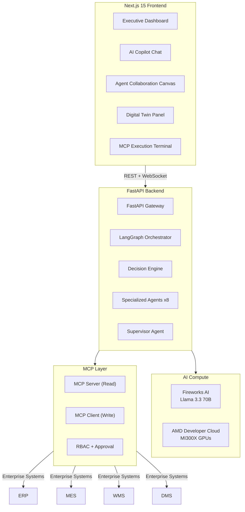

# AIRA — Autonomous Manufacturing Decision Platform

Build a full-stack Autonomous Manufacturing Decision Platform with a Next.js 15 frontend (dashboard-first UX with AI Copilot), a FastAPI + LangGraph multi-agent backend, Digital Twin simulation, MCP enterprise integration layer, and Fireworks AI + AMD Developer Cloud compute infrastructure.

## User Review Required

> [!IMPORTANT]
> **Fireworks AI API Key**: Using `fw_XBwLcAdJNh7FJemS8FCdgB` as provided. This will be stored in `.env`.

> [!IMPORTANT]
> **AMD Developer Cloud**: Per your instruction, AMD cloud integration will use placeholder endpoints that you will update later. The architecture will be ready for real AMD ROCm/vLLM integration.

> [!IMPORTANT]
> **LLM Configuration**: Temperature and max_tokens will be controlled in code. `max_tokens` defaults will be kept conservative. A `max_iterations = 3` limit will be enforced for agent loops inside LangGraph to prevent runaway inference.

> [!WARNING]
> **Supabase**: The existing `.env` has Supabase credentials. The plan uses simulated/mock data for the demo rather than requiring live Supabase tables. If you want real Supabase persistence, let me know.

> [!IMPORTANT]
> **Chart Types**: As specified — **Bar charts & Pie charts** for Sales data, **Line charts** for Telematics data (in chatbot output via Recharts).

## Open Questions

> [!IMPORTANT]
> 1. **Demo Mode vs Live Backend**: Should the demo run with a **live FastAPI backend** (requires Python + dependencies running), or should the frontend use **realistic mock data with simulated agent animations** for a self-contained demo? I recommend **both** — a mock-data demo mode that works standalone + a live backend mode.
> 2. **Deployment Target**: Will this be demo'd locally (`npm run dev` + `uvicorn`), or deployed somewhere? This affects build configuration.
> 3. **Authentication**: The `.env` has demo credentials. Should I implement a login screen, or go straight to the dashboard?

---

## Architecture Overview



---

## Proposed Changes

### Component 1: Project Scaffolding

#### [NEW] Project Root Configuration

- Initialize Next.js 15 with TypeScript, Tailwind CSS, App Router, `src/` directory
- Configure `next.config.ts` with API rewrites to FastAPI backend
- Add dependencies: `framer-motion`, `lucide-react`, `recharts`
- Create Python backend directory with `requirements.txt` and `pyproject.toml`

**Project Structure:**
```
airan/
├── .env                          # Environment variables
├── .env.example                  # Template
├── package.json                  # Next.js dependencies
├── next.config.ts                # Next.js configuration
├── tailwind.config.ts            # Tailwind configuration
├── tsconfig.json                 # TypeScript config
├── src/
│   ├── app/
│   │   ├── layout.tsx            # Root layout (dark theme, fonts)
│   │   ├── page.tsx              # Main dashboard page
│   │   ├── globals.css           # Global styles + design system
│   │   └── api/
│   │       ├── chat/route.ts     # Chat API proxy
│   │       ├── decision/route.ts # Decision API proxy
│   │       └── events/route.ts   # SSE events proxy
│   ├── components/
│   │   ├── dashboard/
│   │   │   ├── SystemHealthIndex.tsx
│   │   │   ├── FactoryMetrics.tsx
│   │   │   ├── RiskStream.tsx
│   │   │   ├── AIRecommendations.tsx
│   │   │   ├── ProductionHealth.tsx
│   │   │   ├── InventoryHealth.tsx
│   │   │   ├── QualityMetrics.tsx
│   │   │   ├── DeliveryPerformance.tsx
│   │   │   ├── EnergyConsumption.tsx
│   │   │   └── AIDecisionFeed.tsx
│   │   ├── agents/
│   │   │   ├── AgentCanvas.tsx          # Animated multi-agent visualization
│   │   │   ├── AgentNode.tsx            # Individual agent node
│   │   │   ├── DataFlowParticles.tsx    # Animated data packets
│   │   │   └── AgentNegotiation.tsx     # Typing animation panel
│   │   ├── digital-twin/
│   │   │   ├── DigitalTwinPanel.tsx     # Simulation panel
│   │   │   └── ScenarioComparison.tsx   # Compare outcomes
│   │   ├── copilot/
│   │   │   ├── CopilotPanel.tsx         # Slide-out chat panel
│   │   │   ├── ChatMessage.tsx          # Message bubble
│   │   │   └── ChartRenderer.tsx        # Render charts in chat
│   │   ├── mcp/
│   │   │   └── MCPTerminal.tsx          # Execution terminal
│   │   ├── charts/
│   │   │   ├── SalesBarChart.tsx        # Bar chart for sales
│   │   │   ├── SalesPieChart.tsx        # Pie chart for sales
│   │   │   └── TelematicsLineChart.tsx  # Line chart for telematics
│   │   └── ui/
│   │       ├── GlassCard.tsx            # Glassmorphism card
│   │       ├── PulsingDot.tsx           # Status indicator
│   │       ├── TypewriterText.tsx       # Typing animation
│   │       ├── ParticleEffect.tsx       # Anomaly particles
│   │       └── HardwareBadge.tsx        # AMD/Fireworks badges
│   ├── lib/
│   │   ├── types.ts                     # TypeScript interfaces
│   │   ├── mockData.ts                  # Demo simulation data
│   │   ├── api.ts                       # API client
│   │   └── constants.ts                 # Constants & config
│   └── hooks/
│       ├── useWebSocket.ts              # WebSocket connection
│       ├── useEventStream.ts            # SSE connection
│       └── useSimulation.ts             # Demo simulation hook
├── backend/
│   ├── requirements.txt
│   ├── main.py                          # FastAPI entry point
│   ├── config.py                        # Configuration
│   ├── agents/
│   │   ├── __init__.py
│   │   ├── supervisor.py                # Supervisor agent
│   │   ├── telematics.py                # Telematics agent
│   │   ├── inventory.py                 # Inventory agent
│   │   ├── production.py                # Production agent
│   │   ├── finance.py                   # Finance agent
│   │   ├── maintenance.py               # Maintenance agent
│   │   ├── logistics.py                 # Logistics agent
│   │   ├── quality.py                   # Quality agent
│   │   └── dealer.py                    # DMS agent
│   ├── graph/
│   │   ├── __init__.py
│   │   ├── state.py                     # LangGraph state definition
│   │   ├── workflow.py                  # LangGraph workflow builder
│   │   └── decision_engine.py           # Decision engine logic
│   ├── digital_twin/
│   │   ├── __init__.py
│   │   └── simulator.py                 # Digital twin simulation
│   ├── mcp/
│   │   ├── __init__.py
│   │   ├── server.py                    # MCP Server (read operations)
│   │   └── client.py                    # MCP Client (write operations)
│   ├── models/
│   │   ├── __init__.py
│   │   └── schemas.py                   # Pydantic models
│   └── data/
│       └── mock_data.py                 # Realistic manufacturing data
```

---

### Component 2: Frontend — Executive Dashboard (Primary Experience)

The dashboard is the **primary interface** — not the chatbot. It immediately shows operational status when the app loads.

#### [NEW] [globals.css](file:///Users/karthikmanikandan/Desktop/airan/src/app/globals.css)
- Dark industrial theme with CSS custom properties
- Glassmorphism utilities (backdrop-blur, glass borders)
- Animated glow effects (green/amber/red health states)
- Custom scrollbar styling
- Pulse, float, and shimmer keyframe animations
- Grid layout system for dashboard cards

#### [NEW] [layout.tsx](file:///Users/karthikmanikandan/Desktop/airan/src/app/layout.tsx)
- Root layout with Inter + JetBrains Mono fonts from Google Fonts
- Dark background (`#0a0a0f`) with subtle grid pattern
- Metadata for SEO: "AIRA — Autonomous Manufacturing Decision Platform"

#### [NEW] [page.tsx](file:///Users/karthikmanikandan/Desktop/airan/src/app/page.tsx)
- Main dashboard page rendering all dashboard sections
- Auto-triggers demo scenario on load (truck battery failure)
- No user prompt needed — proactive intelligence display

#### [NEW] [SystemHealthIndex.tsx](file:///Users/karthikmanikandan/Desktop/airan/src/components/dashboard/SystemHealthIndex.tsx)
- Large circular gauge with animated SVG arc
- Ambient glow pulse (green → amber → red based on score)
- Numeric score (0-100) with status label
- Framer Motion entry animation

#### [NEW] [FactoryMetrics.tsx](file:///Users/karthikmanikandan/Desktop/airan/src/components/dashboard/FactoryMetrics.tsx)
- Grid of KPI cards: OEE, Production Rate, Defect Rate, MTBF, Energy/Unit, On-Time Delivery
- Each card has trend indicator (↑↓), sparkline, glassmorphism styling
- Color-coded based on threshold (good/warning/critical)

#### [NEW] [RiskStream.tsx](file:///Users/karthikmanikandan/Desktop/airan/src/components/dashboard/RiskStream.tsx)
- Real-time scrolling feed of events from ERP, MES, WMS, DMS, IoT, Telematics
- Particle effects on anomaly events
- Source badges (ERP, MES, WMS, DMS, IoT, Telematics)
- Auto-scrolling with pause-on-hover

#### [NEW] [AIRecommendations.tsx](file:///Users/karthikmanikandan/Desktop/airan/src/components/dashboard/AIRecommendations.tsx)
- Cards showing AI-generated recommendations with confidence scores
- "Approve" / "Reject" / "Investigate" buttons
- Business impact metrics (cost savings, downtime avoided)
- Links to AI Copilot for deeper investigation
- Clicking "Investigate" opens the Copilot panel

#### [NEW] [AIDecisionFeed.tsx](file:///Users/karthikmanikandan/Desktop/airan/src/components/dashboard/AIDecisionFeed.tsx)
- Timeline of all AI decisions with status (pending/approved/executed)
- Agent attribution (which agents contributed)
- Expandable details with evidence and reasoning

---

### Component 3: Frontend — Animated Multi-Agent Collaboration Canvas

This is the **centerpiece** — replacing static architecture diagrams with a living visualization.

#### [NEW] [AgentCanvas.tsx](file:///Users/karthikmanikandan/Desktop/airan/src/components/agents/AgentCanvas.tsx)
- SVG/Canvas-based visualization showing:
  - Enterprise system nodes (ERP, MES, WMS, DMS, IoT) on the left
  - MCP gateway nodes in the middle-left
  - LangGraph orchestrator at center
  - Specialized agent nodes arranged in a circle/arc
  - AMD compute node (bottom-left)
  - Fireworks AI node (bottom-right)
  - Decision Engine at center
- Animated data packets (glowing dots) flowing between nodes
- Agent nodes pulse when active
- Connection lines glow when data flows through them

#### [NEW] [AgentNode.tsx](file:///Users/karthikmanikandan/Desktop/airan/src/components/agents/AgentNode.tsx)
- Individual agent node with icon, name, status
- States: idle (dim), active (pulsing glow), complete (green check)
- Hover tooltip showing agent's current task

#### [NEW] [AgentNegotiation.tsx](file:///Users/karthikmanikandan/Desktop/airan/src/components/agents/AgentNegotiation.tsx)
- Panel showing real-time agent "conversation"
- Typewriter animation as each agent reports findings
- Example flow:
  1. 🔧 Telematics Agent: "Battery temp anomaly detected. +41% above threshold..."
  2. 📦 Inventory Agent: "Spare battery available in Warehouse B, Slot R4-C2..."
  3. ⚙️ Production Agent: "Line 3 has maintenance window at 14:00-15:30..."
  4. 💰 Finance Agent: "Estimated savings: ₹2.8L vs ₹19L loss if delayed..."
  5. 🎯 Supervisor: "RECOMMENDATION: Immediate replacement during Line 3 break..."

---

### Component 4: Frontend — Digital Twin Simulation

#### [NEW] [DigitalTwinPanel.tsx](file:///Users/karthikmanikandan/Desktop/airan/src/components/digital-twin/DigitalTwinPanel.tsx)
- Glassmorphism panel with scenario simulation
- Shows current vs projected metrics
- Animated progress bars for each metric
- Explainable AI breakdown:
  - Estimated downtime avoided
  - Production impact
  - Financial savings
  - Confidence score with evidence count
  - Root cause analysis

#### [NEW] [ScenarioComparison.tsx](file:///Users/karthikmanikandan/Desktop/airan/src/components/digital-twin/ScenarioComparison.tsx)
- Side-by-side comparison cards
- Scenario A: "Immediate maintenance" vs Scenario B: "Delay 6 hours"
- Animated metric bars showing differential impact
- Clear winner highlighting with green/red indicators

---

### Component 5: Frontend — AI Copilot (Secondary Interface)

The Copilot is a **slide-out panel**, not the primary experience.

#### [NEW] [CopilotPanel.tsx](file:///Users/karthikmanikandan/Desktop/airan/src/components/copilot/CopilotPanel.tsx)
- Right-side slide-out panel (like GitHub Copilot / Microsoft Copilot)
- Opens when user clicks "Investigate" on a recommendation
- Chat input at bottom with send button
- Streaming response display
- Supports rendering charts inline (bar, pie, line via Recharts)

#### [NEW] [ChatMessage.tsx](file:///Users/karthikmanikandan/Desktop/airan/src/components/copilot/ChatMessage.tsx)
- Message bubble with avatar (AI or user)
- Markdown rendering for AI responses
- Embedded chart rendering for data queries
- Typewriter animation for AI responses

#### [NEW] [ChartRenderer.tsx](file:///Users/karthikmanikandan/Desktop/airan/src/components/copilot/ChartRenderer.tsx)
- Detects chart data in AI responses
- Renders:
  - **Bar charts** for sales data
  - **Pie charts** for sales distribution
  - **Line charts** for telematics data
- Uses Recharts with dark theme styling

---

### Component 6: Frontend — MCP Execution Terminal

#### [NEW] [MCPTerminal.tsx](file:///Users/karthikmanikandan/Desktop/airan/src/components/mcp/MCPTerminal.tsx)
- Authentic terminal UI with monospace font (JetBrains Mono)
- Shows MCP execution logs with timestamps
- Color-coded: green (success), amber (pending), red (error), cyan (info)
- Example output:
  ```
  [14:02:31] MCP → Connecting to ERP (Ramco Systems)...
  [14:02:32] AUTH → JWT verified ✓ Role: plant_manager
  [14:02:33] MCP:READ → Fetching PO#2847 status... OK
  [14:02:34] RBAC → Write operation requires approval
  [14:02:35] APPROVAL → Manager approved: Update PO#2847
  [14:02:36] MCP:WRITE → ERP PO#2847 updated → EXPEDITED ✓
  [14:02:37] MCP:WRITE → MES Schedule updated → Line 3 break extended ✓
  [14:02:38] MCP:WRITE → DMS Notification sent → 3 dealers notified ✓
  [14:02:39] AUDIT → Action logged → ID: AX-2847-MAINT
  ```
- Auto-scroll with typewriter effect per line

---

### Component 7: Frontend — Hardware & Infrastructure Badges

#### [NEW] [HardwareBadge.tsx](file:///Users/karthikmanikandan/Desktop/airan/src/components/ui/HardwareBadge.tsx)
- Three prominent badges displayed in the dashboard header:
  1. **AMD ROCm Core** — "AMD Instinct™ MI300X • ROCm Stack"
  2. **AMD Developer Cloud** — "GPU Cluster • vLLM Inference"
  3. **Fireworks AI** — "Serverless Inference • Llama 3.3 70B"
- Glassmorphism styling with subtle glow
- Hardware icons (CPU, Cloud, Zap from Lucide)

---

### Component 8: Backend — FastAPI Gateway

#### [NEW] [backend/main.py](file:///Users/karthikmanikandan/Desktop/airan/backend/main.py)
- FastAPI app with CORS, WebSocket support
- Endpoints:
  - `POST /api/chat` — AI Copilot chat (streaming)
  - `POST /api/decision` — Trigger decision workflow
  - `GET /api/events` — SSE event stream
  - `GET /api/health` — System health metrics
  - `GET /api/metrics` — Factory metrics
  - `POST /api/simulate` — Digital Twin simulation
  - `POST /api/approve/{action_id}` — Approve/reject actions
  - `WS /ws/agents` — Agent activity WebSocket
- Token limits and temperature configured in code

#### [NEW] [backend/config.py](file:///Users/karthikmanikandan/Desktop/airan/backend/config.py)
- Centralized configuration
- `FIREWORKS_API_KEY` from env
- `LLM_TEMPERATURE = 0.3`
- `LLM_MAX_TOKENS = 1024`
- `MAX_AGENT_ITERATIONS = 3` (as specified)
- AMD Developer Cloud endpoints (placeholder)

---

### Component 9: Backend — LangGraph Multi-Agent Orchestrator

#### [NEW] [backend/graph/state.py](file:///Users/karthikmanikandan/Desktop/airan/backend/graph/state.py)
- `ManufacturingState` TypedDict with:
  - messages, next_agent, agent_results, decision, context, event_data

#### [NEW] [backend/graph/workflow.py](file:///Users/karthikmanikandan/Desktop/airan/backend/graph/workflow.py)
- StateGraph with supervisor pattern
- 8 specialized agents + 1 supervisor
- `max_iterations = 3` enforced
- Conditional routing based on supervisor decisions
- Streaming support for real-time agent activity

#### [NEW] [backend/agents/supervisor.py](file:///Users/karthikmanikandan/Desktop/airan/backend/agents/supervisor.py)
- Routes to appropriate agents based on event type
- Aggregates agent outputs into final decision
- Structured output with confidence scores

#### [NEW] Individual Agent Files
Each agent (telematics, inventory, production, finance, maintenance, logistics, quality, dealer):
- Specialized system prompt
- Domain-specific tools
- Structured output schemas
- Connected to Fireworks AI via `ChatFireworks`

---

### Component 10: Backend — Digital Twin Simulator

#### [NEW] [backend/digital_twin/simulator.py](file:///Users/karthikmanikandan/Desktop/airan/backend/digital_twin/simulator.py)
- Scenario simulation engine
- Takes current state + proposed action → projects outcomes
- Metrics: downtime, production loss, financial impact, delivery delay
- Confidence scoring based on historical correlations
- Returns structured comparison data

---

### Component 11: Backend — MCP Integration Layer

#### [NEW] [backend/mcp/server.py](file:///Users/karthikmanikandan/Desktop/airan/backend/mcp/server.py)
- MCP Server (Read APIs)
- Simulated read operations from ERP, MES, WMS, DMS
- Returns realistic manufacturing data

#### [NEW] [backend/mcp/client.py](file:///Users/karthikmanikandan/Desktop/airan/backend/mcp/client.py)
- MCP Client (Write APIs)
- RBAC-gated write operations
- Approval workflow (pending → approved → executed)
- Audit logging for all actions

---

### Component 12: Demo Scenario — Truck Battery Failure

The demo auto-plays on page load:

1. **T+0s**: Dashboard loads with all metrics green, System Health at 94%
2. **T+3s**: Risk Stream detects truck battery temperature anomaly
3. **T+4s**: System Health drops to 72%, amber state
4. **T+5s**: Agent Canvas activates — Telematics Agent lights up
5. **T+6-12s**: Agents activate sequentially with typewriter negotiations
6. **T+13s**: Supervisor delivers recommendation card
7. **T+14s**: Recommendation appears with "Approve" button
8. **User clicks Approve**: MCP Terminal shows execution
9. **Post-approval**: System Health returns to 91%, metrics update
10. **User clicks "Investigate"**: Copilot panel opens with explanation

---

## Verification Plan

### Automated Tests
```bash
# Frontend
npm run build          # Verify Next.js builds without errors
npm run lint           # ESLint passes

# Backend
cd backend && python -m pytest    # (if time permits)
uvicorn main:app --port 8000      # Backend starts successfully
```

### Manual Verification
- Dashboard loads immediately with animated metrics
- System Health Index shows ambient glow animation
- Agent Canvas shows animated data flow
- Demo scenario auto-plays the truck battery failure
- Copilot panel opens on "Investigate" click
- MCP Terminal shows execution logs on "Approve"
- Charts render correctly (bar/pie for sales, line for telematics)
- All animations are smooth (60fps target)
- Hardware badges are prominent
- Mobile responsive (though optimized for desktop/large screens)
